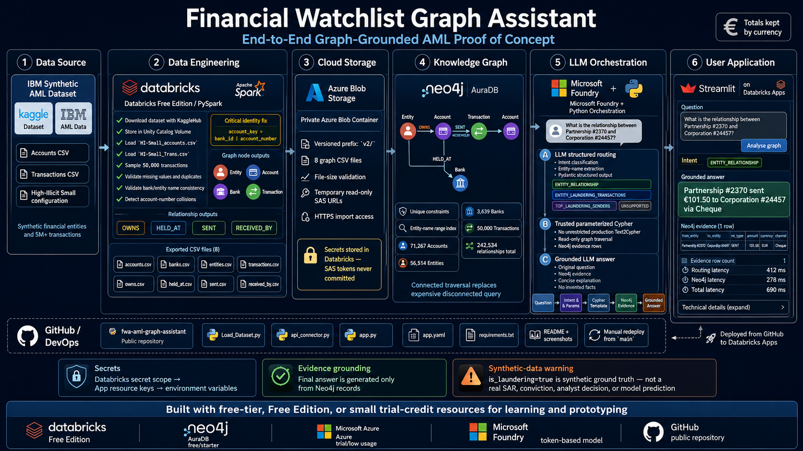
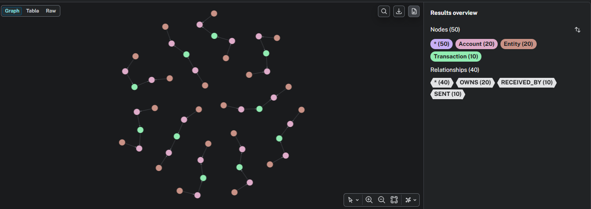
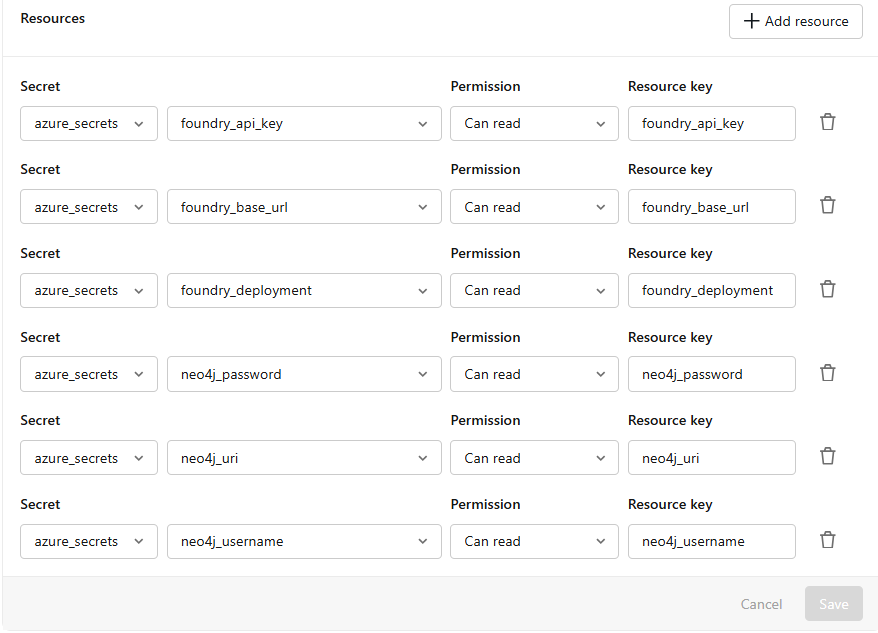
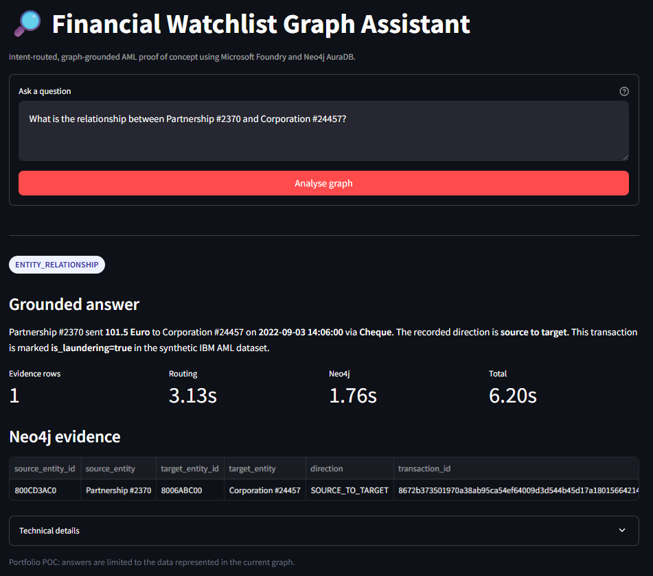
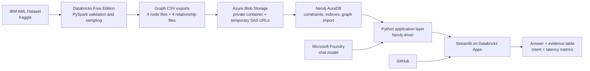
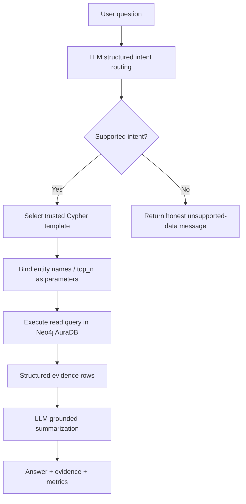

# Financial Watchlist Graph Assistant

> **An intent-routed, graph-grounded AML proof of concept built with Databricks, Neo4j AuraDB, Microsoft Foundry, Azure Blob Storage, and Streamlit.**

<p align="center">
  
</p>

<p align="center">
  <strong>Natural-language question → structured intent → trusted Cypher → Neo4j evidence → grounded LLM answer</strong>
</p>

---

## Table of contents

- [Project overview](#project-overview)
- [What this project is—and is not](#what-this-project-isand-is-not)
- [Demo](#demo)
- [Architecture](#architecture)
- [Technology and cost profile](#technology-and-cost-profile)
- [Dataset](#dataset)
- [Graph data model](#graph-data-model)
- [Repository structure](#repository-structure)
- [Rebuild the project from scratch](#rebuild-the-project-from-scratch)
  - [1. Create the required accounts and resources](#1-create-the-required-accounts-and-resources)
  - [2. Configure the Databricks CLI and verify the workspace](#2-configure-the-databricks-cli-and-verify-the-workspace)
  - [3. Create Databricks secrets](#3-create-databricks-secrets)
  - [4. Load and prepare the IBM AML dataset](#4-load-and-prepare-the-ibm-aml-dataset)
  - [5. Build and validate graph exports](#5-build-and-validate-graph-exports)
  - [6. Upload graph CSV files to Azure Blob Storage](#6-upload-graph-csv-files-to-azure-blob-storage)
  - [7. Create and configure Neo4j AuraDB](#7-create-and-configure-neo4j-auradb)
  - [8. Generate temporary SAS URLs](#8-generate-temporary-sas-urls)
  - [9. Import nodes and relationships into Neo4j](#9-import-nodes-and-relationships-into-neo4j)
  - [10. Create and test the Microsoft Foundry deployment](#10-create-and-test-the-microsoft-foundry-deployment)
  - [11. Test Foundry and Neo4j from Databricks](#11-test-foundry-and-neo4j-from-databricks)
  - [12. Run the graph-grounded assistant](#12-run-the-graph-grounded-assistant)
  - [13. Deploy the Streamlit application](#13-deploy-the-streamlit-application)
- [Supported questions](#supported-questions)
- [Expected validation results](#expected-validation-results)
- [Important engineering decisions](#important-engineering-decisions)
- [Troubleshooting](#troubleshooting)
- [Security and responsible-use notes](#security-and-responsible-use-notes)
- [Limitations](#limitations)
- [Future extensions](#future-extensions)
- [Reproduction checklist](#reproduction-checklist)
- [References](#references)

---

## Project overview

The **Financial Watchlist Graph Assistant** is a portfolio proof of concept for investigating relationships in synthetic financial transaction data.

The project converts the [IBM synthetic AML dataset](https://github.com/IBM/AML-Data) into a Neo4j knowledge graph containing:

- financial entities,
- bank accounts,
- banks,
- transactions,
- account ownership,
- account-bank relationships,
- sender relationships,
- receiver relationships.

A user can then ask natural-language questions such as:

```text
What is the relationship between Partnership #2370 and Corporation #24457?
```

The application:

1. uses a Microsoft Foundry model to classify the question and extract parameters;
2. selects a trusted, optimized, parameterized Cypher template;
3. queries Neo4j AuraDB;
4. receives structured evidence rows;
5. asks the model to explain only those evidence rows;
6. shows the answer, raw Neo4j evidence, detected intent, and latency metrics in Streamlit.

### Example result

For the relationship question above, the graph returned evidence that:

- `Partnership #2370` sent money to `Corporation #24457`;
- the amount was `101.5 Euro`;
- the payment format was `Cheque`;
- the transaction occurred on `2022-09-03 14:06:00`;
- the transaction had `is_laundering=true` in the synthetic source dataset.

> [!WARNING]
> `is_laundering=true` is **synthetic dataset ground truth**. It is not a real suspicious activity report, legal finding, conviction, analyst decision, or model prediction.

---

## What this project is—and is not

### What it is

This is an:

> **intent-routed, graph-grounded AML assistant using structured LLM extraction, parameterized Neo4j retrieval, and evidence-grounded answer generation.**

It demonstrates:

- graph modeling,
- PySpark data preparation,
- data-quality validation,
- cloud object storage,
- Neo4j import and query design,
- structured LLM output,
- secure secret handling,
- lightweight application deployment.

### What it is not

The current application is **not yet a full hybrid/vector GraphRAG system**.

It does not currently retrieve:

- sanctions lists,
- watchlist records,
- adverse-media articles,
- unstructured investigation documents,
- embeddings or vector-search results,
- external merchant-risk classifications.

An initial unrestricted Text2Cypher experiment was tested, but an inefficient LLM-generated query timed out. The production-facing POC therefore uses **trusted Cypher templates** selected by an LLM intent router. This is faster, safer, easier to test, and more predictable.

---

## Demo

### Neo4j graph structure

<p align="center">
  
</p>

The displayed path follows the core transaction pattern:

```text
Sender Entity
   └── OWNS → Sender Account
                  └── SENT → Transaction
                                  └── RECEIVED_BY → Receiver Account
                                                          ← OWNS ─ Receiver Entity
```

### Databricks App secret resources

<p align="center">
  
</p>

### Final Streamlit application

<p align="center">
  
</p>

---

## Architecture

### End-to-end data and application flow



### Question-answering flow



### Why two model calls are used

For supported questions, the application normally performs:

1. **Routing call**  
   Produces a structured object such as:

   ```json
   {
     "intent": "ENTITY_RELATIONSHIP",
     "source_entity_name": "Partnership #2370",
     "target_entity_name": "Corporation #24457",
     "top_n": 5
   }
   ```

2. **Answer-generation call**  
   Receives the original question and the Neo4j evidence, then converts the evidence into concise human language.

The LLM does not decide the transaction amount, date, direction, entities, or laundering label. Those values come from Neo4j.

---

## Technology and cost profile

This project was intentionally built with free-tier, free-edition, or small-credit resources where possible.

| Service | Role | Resource used in this project | Cost note |
|---|---|---|---|
| Databricks | Data engineering, notebooks, secrets, Streamlit app hosting | **Databricks Free Edition** | No-cost learning/prototyping edition with quotas and limitations |
| Neo4j | Graph database and Cypher retrieval | **Neo4j AuraDB free/starter instance** | Free option where available; capacity is limited |
| Microsoft Foundry | Intent routing and grounded answer generation | Small deployed chat model (`gpt-5.4-mini` in this build) | Model inference is consumption based; trial/free Azure credits may cover a small POC |
| Azure Blob Storage | Temporary hosting of graph CSV files for Neo4j import | Private blob container | Azure free credit or very small pay-as-you-go usage; not permanently free by default |
| Streamlit | Interactive user interface | Hosted as a Databricks App | Covered by the Databricks environment used for the POC |
| GitHub | Source control and portfolio documentation | Public repository | Free public repository |
| Kaggle | Dataset distribution | IBM AML dataset mirror | Free dataset access |

> [!IMPORTANT]
> “Free” does not mean unlimited. Pricing, quotas, model availability, and free-tier conditions can change. Check the current service documentation before reproducing the project.

> [!NOTE]
> At the time of this build, Databricks Free Edition was intended for non-commercial learning and prototyping and had quotas on compute and Apps. A stopped app can be restarted from the Databricks workspace.

---

## Dataset

The project uses the IBM synthetic anti-money-laundering dataset:

- [IBM AML-Data repository](https://github.com/IBM/AML-Data)
- [Kaggle dataset mirror](https://www.kaggle.com/datasets/ealtman2019/ibm-transactions-for-anti-money-laundering-aml)

The downloaded dataset contains several configurations:

```text
HI-Small_accounts.csv
HI-Small_Trans.csv
HI-Medium_accounts.csv
HI-Medium_Trans.csv
HI-Large_accounts.csv
HI-Large_Trans.csv
LI-Small_accounts.csv
LI-Small_Trans.csv
...
```

This POC uses:

```text
HI-Small_accounts.csv
HI-Small_Trans.csv
```

The source files contain approximately:

- `518,581` account metadata rows;
- `5,078,345` transaction rows.

For fast development, the notebook creates a `50,000`-transaction sample:

```python
df_trans_sample = (
    df_trans
    .sample(fraction=0.01, seed=42)
    .limit(50_000)
)
```

> [!NOTE]
> The seed improves reproducibility, but Spark partitioning/runtime changes may cause the exact sampled records—and therefore derived Entity/Bank counts—to vary in another workspace. The final transaction count should remain 50,000, while connected node counts may vary slightly.

---

## Graph data model

### Nodes

#### `Entity`

```text
id: STRING, unique
name: STRING
```

Examples:

```text
Partnership #2370
Corporation #24457
Sole Proprietorship #41
```

#### `Account`

```text
account_key: STRING, unique
account_number: STRING
```

Example:

```text
10057|803AA8E90
```

#### `Bank`

```text
bank_id: INTEGER, unique
name: STRING
```

#### `Transaction`

```text
transaction_id: STRING, unique
timestamp: LOCAL DATETIME
amount_received: FLOAT
receiving_currency: STRING
amount_paid: FLOAT
payment_currency: STRING
payment_format: STRING
is_laundering: BOOLEAN
```

### Relationships

```text
(Entity)-[:OWNS]->(Account)
(Account)-[:HELD_AT]->(Bank)
(Account)-[:SENT]->(Transaction)
(Transaction)-[:RECEIVED_BY]->(Account)
```

### Critical account identity decision

The original account number is not globally unique in the source data. Eight account numbers were found under multiple bank/entity combinations.

Therefore, this project defines:

```text
account_key = bank_id + "|" + account_number
```

For example:

```text
1490|81211BA20
```

> [!IMPORTANT]
> Do not use `account_number` alone as the Neo4j uniqueness key. Use `account_key`.

---

## Repository structure

```text
graph_rag_tm_ibm/
│
├── images/
│   ├── graph.png
│   ├── secret.png
│   ├── result.png
│   └── project_roadmap.png        # generated architecture image
│
├── Load_Dataset.py                # Databricks-exported data preparation notebook
├── api_connector.py               # Databricks-exported connection and POC notebook
├── app.py                         # Streamlit application
├── app.yaml                       # Databricks App specification
├── requirements.txt               # Streamlit application dependencies
├── .gitignore
└── README.md
```

### Main files

| File | Purpose |
|---|---|
| `Load_Dataset.py` | Downloads the dataset, validates identities and metadata, creates node/relationship dataframes, exports graph CSVs, uploads to Azure |
| `api_connector.py` | Tests Microsoft Foundry and Neo4j connectivity and contains notebook-side experiments |
| `app.py` | Implements routing, trusted Cypher retrieval, grounded answer generation, and Streamlit UI |
| `app.yaml` | Starts the Databricks App and maps secret resources to environment variables |
| `requirements.txt` | Installs Streamlit, OpenAI, Neo4j, Pydantic, and pandas |

---

# Rebuild the project from scratch

## 1. Create the required accounts and resources

Create or obtain access to:

1. **Databricks Free Edition**
2. **Azure subscription**
3. **Azure Storage Account**
4. **Microsoft Foundry project/resource**
5. **Neo4j AuraDB**
6. **GitHub**
7. **Kaggle**

Useful official starting points:

- [Databricks Free Edition](https://docs.databricks.com/aws/en/getting-started/free-edition)
- [Create an Azure Storage Account](https://learn.microsoft.com/en-us/azure/storage/common/storage-account-create)
- [Microsoft Foundry documentation](https://learn.microsoft.com/en-us/azure/foundry/)
- [Neo4j Aura documentation](https://neo4j.com/docs/aura/)

---

## 2. Configure the Databricks CLI and verify the workspace

Install the current Databricks CLI and authenticate it.

When multiple workspaces are configured, list profiles first:

```bash
databricks auth profiles
```

Create or refresh a profile:

```bash
databricks auth login --host https://<your-workspace-host> --profile DEFAULT
```

Verify the selected profile:

```bash
databricks current-user me -p DEFAULT
```

You can also run a harmless workspace command:

```bash
databricks workspace list / -p DEFAULT
```

> [!IMPORTANT]
> This project used `-p DEFAULT` because more than one Databricks workspace/profile existed.
>
> Before running secret commands, confirm that `DEFAULT` points to the intended workspace. Replace `DEFAULT` with another profile name when necessary.

---

## 3. Create Databricks secrets

### 3.1 Create the scope

This project used:

```text
azure_secrets
```

Create it:

```bash
databricks secrets create-scope azure_secrets -p DEFAULT
```

If it may already exist:

```bash
databricks secrets list-scopes -p DEFAULT
```

### 3.2 Add the secrets

Run each command and enter the value when prompted:

```bash
databricks secrets put-secret azure_secrets storage_connection_string -p DEFAULT

databricks secrets put-secret azure_secrets foundry_api_key -p DEFAULT
databricks secrets put-secret azure_secrets foundry_base_url -p DEFAULT
databricks secrets put-secret azure_secrets foundry_deployment -p DEFAULT

databricks secrets put-secret azure_secrets neo4j_uri -p DEFAULT
databricks secrets put-secret azure_secrets neo4j_username -p DEFAULT
databricks secrets put-secret azure_secrets neo4j_password -p DEFAULT
```

List the stored key names:

```bash
databricks secrets list-secrets azure_secrets -p DEFAULT
```

Expected key names:

```text
foundry_api_key
foundry_base_url
foundry_deployment
neo4j_password
neo4j_uri
neo4j_username
storage_connection_string
```

> [!WARNING]
> Never paste secret values into notebooks, GitHub, screenshots, README files, or issue descriptions.

> [!NOTE]
> `AURA_INSTANCEID` and `AURA_INSTANCENAME` are not required by the Neo4j Python driver. The application needs only the Aura URI, username, and password.

### 3.3 Better secret isolation for a future rebuild

This build reused `azure_secrets`. Databricks App permissions apply at the scope level, so a cleaner production-style setup would create a separate scope containing only the six app secrets:

```text
financial_watchlist_app
```

Then map that scope’s secrets to the app. This prevents the app from receiving scope-level access to unrelated secrets such as the storage connection string.

---

## 4. Load and prepare the IBM AML dataset

Open `Load_Dataset.py` in Databricks or import it as a notebook.

### 4.1 Create the Unity Catalog volume

```sql
USE CATALOG main;
USE SCHEMA default;

CREATE VOLUME IF NOT EXISTS main.default.aml_dataset;
```

The volume path is:

```text
/Volumes/main/default/aml_dataset
```

### 4.2 Install notebook dependencies

```python
%pip install kagglehub azure-storage-blob
```

Restart Python only when Databricks requests it:

```python
dbutils.library.restartPython()
```

> [!WARNING]
> `restartPython()` clears in-memory variables, imports, clients, and helper functions. Rerun earlier initialization cells afterward.

### 4.3 Download the dataset

The notebook uses:

```python
import kagglehub

download_path = kagglehub.dataset_download(
    "ealtman2019/ibm-transactions-for-anti-money-laundering-aml"
)
```

It then copies the downloaded files into the Unity Catalog volume.

### 4.4 Load the selected files

```python
df_trans = spark.read.csv(
    "/Volumes/main/default/aml_dataset/HI-Small_Trans.csv",
    header=True,
    inferSchema=True,
)

df_accounts = spark.read.csv(
    "/Volumes/main/default/aml_dataset/HI-Small_accounts.csv",
    header=True,
    inferSchema=True,
)
```

### 4.5 Create the development sample

```python
df_trans_sample = (
    df_trans
    .sample(fraction=0.01, seed=42)
    .limit(50_000)
)
```

---

## 5. Build and validate graph exports

Run all validation and export sections in `Load_Dataset.py`.

### 5.1 Validate account identity

The account metadata validation should check:

- total metadata rows;
- distinct account numbers;
- distinct `(bank_id, account_number)` pairs;
- account numbers linked to multiple banks/entities;
- duplicate bank-account-entity records;
- missing bank/entity metadata.

The original run found:

```text
Total account rows:                     518,581
Distinct account numbers:               518,573
Distinct bank-account pairs:            518,581
Distinct entities:                      166,207
Distinct banks:                          30,470
Conflicting account numbers:                  8
Duplicate bank-account-entity records:        0
Missing metadata values:                     0
```

### 5.2 Build Account nodes correctly

Extract both sender and receiver account-bank pairs:

```python
sender_accounts = df_trans_sample.select(
    F.col("From Bank").cast("long").alias("bank_id"),
    F.trim(F.col("Account2")).alias("account_number"),
)

receiver_accounts = df_trans_sample.select(
    F.col("To Bank").cast("long").alias("bank_id"),
    F.trim(F.col("Account4")).alias("account_number"),
)
```

Join metadata using both:

```text
bank_id
account_number
```

Create the stable key:

```python
F.concat_ws(
    "|",
    F.col("bank_id").cast("string"),
    F.col("account_number"),
).alias("account_key")
```

### 5.3 Build Bank and Entity nodes

Use only banks and entities connected to the 50,000 sampled transactions.

Validate that:

- every bank ID maps to one bank name;
- every entity ID maps to one entity name;
- no required names are missing.

### 5.4 Build Transaction nodes

Each sampled transaction must receive a deterministic unique `transaction_id`.

The notebook should validate:

- 50,000 transaction rows;
- 50,000 distinct transaction IDs;
- zero invalid timestamps;
- zero missing account endpoints.

The original run produced:

```text
Transaction nodes:          50,000
Distinct transaction IDs:   50,000
Invalid timestamps:              0
Self-transfers:              5,888
Laundering-labelled rows:       56
```

### 5.5 Build relationship exports

Create:

```text
owns.csv
held_at.csv
sent.csv
received_by.csv
```

Validate all relationship endpoints before export.

Expected relationship counts in the original run:

```text
OWNS            71,267
HELD_AT         71,267
SENT            50,000
RECEIVED_BY     50,000
```

### 5.6 Export the eight CSV files

Use a separate versioned output directory:

```text
/Volumes/main/default/aml_dataset/graph_rag_data_v2/
```

Final files:

```text
accounts.csv
banks.csv
entities.csv
transactions.csv
owns.csv
held_at.csv
sent.csv
received_by.csv
```

Original export validation:

| File | Rows |
|---|---:|
| `accounts.csv` | 71,267 |
| `banks.csv` | 3,639 |
| `entities.csv` | 56,514 |
| `transactions.csv` | 50,000 |
| `owns.csv` | 71,267 |
| `held_at.csv` | 71,267 |
| `sent.csv` | 50,000 |
| `received_by.csv` | 50,000 |

> [!IMPORTANT]
> Do not continue to Neo4j until expected and actual CSV row counts match.

---

## 6. Upload graph CSV files to Azure Blob Storage

### 6.1 Create the storage account

In the Azure portal:

1. open **Storage accounts**;
2. choose **Create**;
3. select the subscription and resource group;
4. choose a globally unique storage-account name;
5. use **Standard** performance for the POC;
6. choose a low-cost redundancy option such as LRS;
7. create the resource.

### 6.2 Create a private container

Inside the storage account:

1. open **Data storage → Containers**;
2. create a container such as:

   ```text
   aml-graph-data
   ```

3. keep anonymous/public access disabled.

### 6.3 Store the connection string in Databricks

In Azure:

```text
Storage account → Access keys → Connection string
```

Store it as:

```text
scope: azure_secrets
key: storage_connection_string
```

### 6.4 Upload under a versioned prefix

Use:

```text
v2/
```

Result:

```text
v2/accounts.csv
v2/banks.csv
v2/entities.csv
v2/transactions.csv
v2/owns.csv
v2/held_at.csv
v2/sent.csv
v2/received_by.csv
```

Versioning avoids confusing the corrected exports with an earlier graph design.

### 6.5 Validate uploaded files

Compare local and Azure blob sizes. Every `size_matches` value should be `true`.

Also verify that exactly eight blobs exist under `v2/`.

---

## 7. Create and configure Neo4j AuraDB

### 7.1 Create the instance

1. sign in to [Neo4j Aura](https://console.neo4j.io/);
2. create an AuraDB instance;
3. select a free/starter option where available;
4. download or securely record:
   - URI,
   - username,
   - password.

Example URI format:

```text
neo4j+s://<instance-id>.databases.neo4j.io
```

> [!WARNING]
> Save the generated password immediately. Do not commit the credential file.

### 7.2 Create uniqueness constraints

Run in Neo4j Query:

```cypher
CREATE CONSTRAINT account_account_key_unique IF NOT EXISTS
FOR (a:Account)
REQUIRE a.account_key IS UNIQUE;
```

```cypher
CREATE CONSTRAINT bank_bank_id_unique IF NOT EXISTS
FOR (b:Bank)
REQUIRE b.bank_id IS UNIQUE;
```

```cypher
CREATE CONSTRAINT entity_id_unique IF NOT EXISTS
FOR (e:Entity)
REQUIRE e.id IS UNIQUE;
```

```cypher
CREATE CONSTRAINT transaction_id_unique IF NOT EXISTS
FOR (t:Transaction)
REQUIRE t.transaction_id IS UNIQUE;
```

### 7.3 Create an Entity-name index

The application searches Entity nodes by exact name. Create a range index:

```cypher
CREATE RANGE INDEX entity_name_index IF NOT EXISTS
FOR (e:Entity)
ON (e.name);
```

Validate:

```cypher
SHOW RANGE INDEXES
YIELD name, state, labelsOrTypes, properties
WHERE name = 'entity_name_index'
RETURN name, state, labelsOrTypes, properties;
```

Expected state:

```text
ONLINE
```

> [!IMPORTANT]
> This index was added after an early query timed out. It materially improves name-based graph traversal.

---

## 8. Generate temporary SAS URLs

Keep the container private and create temporary **read-only** SAS URLs.

Recommended properties:

```text
permission: read only
protocol: HTTPS
start: a few minutes in the past
expiry: one or two hours in the future
```

Validate each URL with a small byte-range request before importing.

Expected HTTP status:

```text
206 Partial Content
```

> [!WARNING]
> A SAS URL is a temporary credential. Never commit it, paste it into an issue, include it in screenshots, or store it in this README.

If the Neo4j import reports:

```text
Could not load external resource
```

check:

- SAS token expiry;
- read permission;
- blob path and casing;
- HTTPS URL;
- storage firewall/network restrictions.

---

## 9. Import nodes and relationships into Neo4j

Use the eight SAS URLs generated in the previous step.

Run imports in this order:

1. Account
2. Bank
3. Entity
4. Transaction
5. OWNS
6. HELD_AT
7. SENT
8. RECEIVED_BY

### 9.1 Import Account nodes

```cypher
LOAD CSV WITH HEADERS
FROM '<ACCOUNTS_SAS_URL>' AS row

WITH row
WHERE row.account_key IS NOT NULL
  AND trim(row.account_key) <> ''

CALL (row) {
    MERGE (a:Account {
        account_key: trim(row.account_key)
    })
    SET a.account_number = trim(row.account_number)
}
IN TRANSACTIONS OF 5000 ROWS;
```

### 9.2 Import Bank nodes

```cypher
LOAD CSV WITH HEADERS
FROM '<BANKS_SAS_URL>' AS row

WITH row
WHERE row.bank_id IS NOT NULL
  AND trim(row.bank_id) <> ''

CALL (row) {
    MERGE (b:Bank {
        bank_id: toInteger(trim(row.bank_id))
    })
    SET b.name = trim(row.name)
}
IN TRANSACTIONS OF 1000 ROWS;
```

### 9.3 Import Entity nodes

```cypher
LOAD CSV WITH HEADERS
FROM '<ENTITIES_SAS_URL>' AS row

WITH row
WHERE row.id IS NOT NULL
  AND trim(row.id) <> ''

CALL (row) {
    MERGE (e:Entity {
        id: trim(row.id)
    })
    SET e.name = trim(row.name)
}
IN TRANSACTIONS OF 5000 ROWS;
```

### 9.4 Import Transaction nodes

```cypher
LOAD CSV WITH HEADERS
FROM '<TRANSACTIONS_SAS_URL>' AS row

WITH row
WHERE row.transaction_id IS NOT NULL
  AND trim(row.transaction_id) <> ''

CALL (row) {
    MERGE (t:Transaction {
        transaction_id: trim(row.transaction_id)
    })
    SET
        t.timestamp =
            CASE
                WHEN row.timestamp IS NULL OR trim(row.timestamp) = ''
                THEN null
                ELSE localdatetime(
                    replace(trim(row.timestamp), ' ', 'T')
                )
            END,
        t.amount_received = toFloat(row.amount_received),
        t.receiving_currency = trim(row.receiving_currency),
        t.amount_paid = toFloat(row.amount_paid),
        t.payment_currency = trim(row.payment_currency),
        t.payment_format = trim(row.payment_format),
        t.is_laundering =
            CASE toLower(trim(row.is_laundering))
                WHEN '1' THEN true
                WHEN 'true' THEN true
                ELSE false
            END
}
IN TRANSACTIONS OF 5000 ROWS;
```

### 9.5 Import `OWNS`

```cypher
LOAD CSV WITH HEADERS
FROM '<OWNS_SAS_URL>' AS row

WITH row
WHERE row.entity_id IS NOT NULL
  AND row.account_key IS NOT NULL

CALL (row) {
    MATCH (e:Entity {
        id: trim(row.entity_id)
    })
    MATCH (a:Account {
        account_key: trim(row.account_key)
    })
    MERGE (e)-[:OWNS]->(a)
}
IN TRANSACTIONS OF 5000 ROWS;
```

### 9.6 Import `HELD_AT`

```cypher
LOAD CSV WITH HEADERS
FROM '<HELD_AT_SAS_URL>' AS row

WITH row
WHERE row.account_key IS NOT NULL
  AND row.bank_id IS NOT NULL

CALL (row) {
    MATCH (a:Account {
        account_key: trim(row.account_key)
    })
    MATCH (b:Bank {
        bank_id: toInteger(trim(row.bank_id))
    })
    MERGE (a)-[:HELD_AT]->(b)
}
IN TRANSACTIONS OF 5000 ROWS;
```

### 9.7 Import `SENT`

```cypher
LOAD CSV WITH HEADERS
FROM '<SENT_SAS_URL>' AS row

WITH row
WHERE row.account_key IS NOT NULL
  AND row.transaction_id IS NOT NULL

CALL (row) {
    MATCH (a:Account {
        account_key: trim(row.account_key)
    })
    MATCH (t:Transaction {
        transaction_id: trim(row.transaction_id)
    })
    MERGE (a)-[:SENT]->(t)
}
IN TRANSACTIONS OF 5000 ROWS;
```

### 9.8 Import `RECEIVED_BY`

```cypher
LOAD CSV WITH HEADERS
FROM '<RECEIVED_BY_SAS_URL>' AS row

WITH row
WHERE row.transaction_id IS NOT NULL
  AND row.account_key IS NOT NULL

CALL (row) {
    MATCH (t:Transaction {
        transaction_id: trim(row.transaction_id)
    })
    MATCH (a:Account {
        account_key: trim(row.account_key)
    })
    MERGE (t)-[:RECEIVED_BY]->(a)
}
IN TRANSACTIONS OF 5000 ROWS;
```

### 9.9 Validate graph counts

```cypher
CALL {
    MATCH (n:Account)
    RETURN 'Account' AS node_type, count(n) AS node_count

    UNION ALL

    MATCH (n:Bank)
    RETURN 'Bank' AS node_type, count(n) AS node_count

    UNION ALL

    MATCH (n:Entity)
    RETURN 'Entity' AS node_type, count(n) AS node_count

    UNION ALL

    MATCH (n:Transaction)
    RETURN 'Transaction' AS node_type, count(n) AS node_count
}
RETURN node_type, node_count
ORDER BY node_type;
```

```cypher
MATCH ()-[r]->()
RETURN type(r) AS relationship_type, count(r) AS relationship_count
ORDER BY relationship_type;
```

### 9.10 Inspect transaction paths

```cypher
MATCH path =
    (sender_entity:Entity)-[:OWNS]->
    (sender_account:Account)-[:SENT]->
    (transaction:Transaction)-[:RECEIVED_BY]->
    (receiver_account:Account)<-[:OWNS]-
    (receiver_entity:Entity)

RETURN path
LIMIT 10;
```

---

## 10. Create and test the Microsoft Foundry deployment

### 10.1 Create a Foundry project

1. open Microsoft Foundry;
2. create a project;
3. open **Discover → Models**;
4. select a current small chat-capable model.

This project used:

```text
gpt-5.4-mini
```

with a Global Standard/default deployment.

> [!NOTE]
> Model availability and lifecycle change. If this model is unavailable or deprecated, deploy another supported small chat model and store its deployment name in `foundry_deployment`.

### 10.2 Test the model in the playground

System instruction:

```text
You are a concise financial crime data assistant.
Follow the user's requested output format exactly.
Do not invent facts or data.
```

User message:

```text
Reply with exactly: LLM connection successful
```

Expected response:

```text
LLM connection successful
```

### 10.3 Record the connection values

Store:

```text
foundry_api_key
foundry_base_url
foundry_deployment
```

The base URL used by this project follows a pattern such as:

```text
https://<resource-name>.services.ai.azure.com/openai/v1
```

> [!WARNING]
> The API key and endpoint must belong to the same active Foundry/Azure resource. A mismatch commonly causes HTTP 401.

---

## 11. Test Foundry and Neo4j from Databricks

Open `api_connector.py`.

### 11.1 Read secrets

```python
SECRET_SCOPE = "azure_secrets"

def get_secret(name: str) -> str:
    value = dbutils.secrets.get(
        scope=SECRET_SCOPE,
        key=name,
    ).strip()

    if not value:
        raise ValueError(f"Secret '{name}' is empty.")

    return value
```

### 11.2 Test Foundry

```python
from openai import OpenAI

client = OpenAI(
    base_url=get_secret("foundry_base_url"),
    api_key=get_secret("foundry_api_key"),
)

response = client.responses.create(
    model=get_secret("foundry_deployment"),
    input="What is the capital of France?",
)

print(response.output_text)
```

### 11.3 Test Neo4j

```python
from neo4j import GraphDatabase

driver = GraphDatabase.driver(
    get_secret("neo4j_uri"),
    auth=(
        get_secret("neo4j_username"),
        get_secret("neo4j_password"),
    ),
)

driver.verify_connectivity()

records, _, _ = driver.execute_query(
    """
    MATCH (e:Entity)
    RETURN count(e) AS entity_count
    """,
    database_="neo4j",
)

print(records[0]["entity_count"])
driver.close()
```

Expected Entity count in the original build:

```text
56514
```

---

## 12. Run the graph-grounded assistant

The final application supports four intents:

```text
ENTITY_RELATIONSHIP
ENTITY_LAUNDERING_TRANSACTIONS
TOP_LAUNDERING_SENDERS
UNSUPPORTED
```

### Why trusted templates are used

The initial experiment allowed the LLM to generate unrestricted Cypher. The generated query was syntactically valid but matched disconnected patterns and timed out after 30 seconds.

An optimized connected graph traversal returned the same relationship in approximately:

```text
1.19 seconds
```

The final design therefore uses:

```text
question
→ LLM intent and parameter extraction
→ trusted parameterized Cypher
→ Neo4j evidence
→ grounded answer
```

This is a deliberate engineering choice—not a failure to implement Text2Cypher.

### Run the POC tests

Use these questions:

```text
What is the relationship between Partnership #2370 and Corporation #24457?
```

```text
Show laundering-labelled transactions connected to Partnership #2370.
```

```text
Which five entities sent the most laundering-labelled transactions?
```

```text
Which customers are linked to high-risk merchants?
```

Expected routing:

| Question | Expected intent |
|---|---|
| Relationship between two entities | `ENTITY_RELATIONSHIP` |
| Labelled transactions for one entity | `ENTITY_LAUNDERING_TRANSACTIONS` |
| Top senders | `TOP_LAUNDERING_SENDERS` |
| Missing watchlist/merchant-risk data | `UNSUPPORTED` |

---

## 13. Deploy the Streamlit application

### 13.1 Application dependencies

`requirements.txt`:

```text
streamlit==1.38.0
openai>=1.68.0,<3
neo4j>=6.0.0,<7
pydantic>=2.8.0,<3
pandas>=2.0.0,<3
```

### 13.2 Working `app.yaml`

```yaml
command:
  - streamlit
  - run
  - app.py
  - --server.address=0.0.0.0
  - --server.port=${DATABRICKS_APP_PORT}
  - --server.headless=true

env:
  - name: FOUNDRY_API_KEY
    valueFrom: foundry_api_key

  - name: FOUNDRY_BASE_URL
    valueFrom: foundry_base_url

  - name: FOUNDRY_DEPLOYMENT
    valueFrom: foundry_deployment

  - name: NEO4J_URI
    valueFrom: neo4j_uri

  - name: NEO4J_USERNAME
    valueFrom: neo4j_username

  - name: NEO4J_PASSWORD
    valueFrom: neo4j_password

  - name: STREAMLIT_GATHER_USAGE_STATS
    value: "false"
```

> [!IMPORTANT]
> `valueFrom` references the **Databricks App resource key**, not `scope/secret-key`.
>
> Correct:
>
> ```yaml
> valueFrom: foundry_api_key
> ```
>
> Incorrect:
>
> ```yaml
> valueFrom: azure_secrets/foundry_api_key
> ```

### 13.3 Configure Databricks App resources

Add six secret resources:

| Scope | Secret key | Permission | Resource key |
|---|---|---|---|
| `azure_secrets` | `foundry_api_key` | Can read | `foundry_api_key` |
| `azure_secrets` | `foundry_base_url` | Can read | `foundry_base_url` |
| `azure_secrets` | `foundry_deployment` | Can read | `foundry_deployment` |
| `azure_secrets` | `neo4j_uri` | Can read | `neo4j_uri` |
| `azure_secrets` | `neo4j_username` | Can read | `neo4j_username` |
| `azure_secrets` | `neo4j_password` | Can read | `neo4j_password` |

### 13.4 Deploy from Git

Create/configure the app with:

```text
Git repository:
https://github.com/MasouData/graph_rag_tm_ibm.git

Git provider:
GitHub

Git reference:
main

Reference type:
Branch

Source code path:
leave empty
```

Leave the source path empty because `app.py`, `app.yaml`, and `requirements.txt` are in the repository root.

For a public repository, automatic deployment may be unavailable. Redeploy manually after pushing changes.

### 13.5 Verify the deployed application

Test the four example questions. A successful supported result should display:

- detected intent;
- grounded natural-language answer;
- evidence row count;
- routing latency;
- Neo4j latency;
- total latency;
- interactive evidence dataframe;
- expandable routing output and raw evidence.

---

## Supported questions

### 1. Direct relationship between two entities

```text
What is the relationship between Partnership #2370 and Corporation #24457?
```

The application searches transactions in both directions.

### 2. Laundering-labelled transactions connected to one entity

```text
Show laundering-labelled transactions connected to Partnership #2370.
```

The application returns outgoing and incoming labelled transactions, including counterparties and banks.

### 3. Top laundering-labelled senders

```text
Which five entities sent the most laundering-labelled transactions?
```

Totals are grouped by currency to avoid incorrectly summing unrelated currencies.

### 4. Unsupported data

```text
Which customers are linked to high-risk merchants?
```

The current graph has no merchant-risk category, so the application returns an explicit limitation rather than inventing an answer.

---

## Expected validation results

### Graph counts from the original run

#### Nodes

| Label | Count |
|---|---:|
| Account | 71,267 |
| Bank | 3,639 |
| Entity | 56,514 |
| Transaction | 50,000 |

#### Relationships

| Type | Count |
|---|---:|
| OWNS | 71,267 |
| HELD_AT | 71,267 |
| SENT | 50,000 |
| RECEIVED_BY | 50,000 |

### End-to-end relationship test

Question:

```text
What is the relationship between Partnership #2370 and Corporation #24457?
```

Expected evidence:

```json
{
  "source_entity_id": "800CD3AC0",
  "source_entity": "Partnership #2370",
  "target_entity_id": "8006ABC00",
  "target_entity": "Corporation #24457",
  "direction": "SOURCE_TO_TARGET",
  "amount": 101.5,
  "currency": "Euro",
  "payment_format": "Cheque",
  "is_laundering": true
}
```

Typical POC latency observed:

```text
Routing: approximately 2–3 seconds
Neo4j: approximately 0.6–1.8 seconds
Total: approximately 4–7 seconds
```

Latency varies with model capacity, service load, network location, and cold starts.

---

## Important engineering decisions

### 1. Composite Account identity

Problem:

```text
account_number is not globally unique
```

Solution:

```text
account_key = bank_id|account_number
```

Impact:

- prevents merging unrelated accounts;
- preserves the original bank-account identity;
- makes Account uniqueness correct.

### 2. Versioned exports

The corrected graph exports were written to:

```text
graph_rag_data_v2/
```

and uploaded under:

```text
v2/
```

This prevented corrected files from being confused with the first export design.

### 3. Transaction as a node

Instead of a direct:

```text
(Account)-[:TRANSFERRED_TO]->(Account)
```

the model uses:

```text
(Account)-[:SENT]->(Transaction)-[:RECEIVED_BY]->(Account)
```

This allows each transaction to have its own:

- ID,
- timestamp,
- amounts,
- currencies,
- payment format,
- synthetic laundering label.

### 4. Connected graph traversals

A disconnected multi-`MATCH` query caused expensive intermediate combinations and timed out.

The optimized queries begin from indexed Entity names and traverse connected relationships:

```text
Entity → Account → Transaction → Account → Entity
```

### 5. Constrained LLM responsibilities

The LLM performs:

- intent classification;
- entity-name extraction;
- `top_n` extraction;
- grounded explanation.

The application performs:

- query selection;
- parameter binding;
- Neo4j execution;
- evidence preservation;
- unsupported-intent handling.

### 6. Evidence is returned alongside the answer

The Streamlit interface exposes the Neo4j records so that the natural-language answer can be checked against its source evidence.

---

## Troubleshooting

### `Could not load external resource` in Neo4j

Likely causes:

- container is private and URL has no SAS token;
- SAS token expired;
- wrong blob path;
- read permission missing;
- URL copied incompletely.

Fix:

1. regenerate a read-only SAS token;
2. test the URL with an HTTP byte-range request;
3. run `LOAD CSV ... RETURN row LIMIT 3` before importing.

---

### Neo4j shows `OWNS` and `HELD_AT`, but not `SENT` or `RECEIVED_BY`

Cause:

The node imports succeeded, but transaction relationship CSVs were not imported.

Fix:

- import `sent.csv`;
- import `received_by.csv`;
- validate both relationship counts equal 50,000.

---

### `Account.id` constraint conflicts with the corrected graph

Cause:

The first design used `Account.id`, while the corrected design uses `Account.account_key`.

Fix:

1. inspect existing constraints:

   ```cypher
   SHOW CONSTRAINTS;
   ```

2. drop the old Account constraint by name;
3. create `account_account_key_unique`.

---

### Foundry returns HTTP 401

Example:

```text
Access denied due to invalid subscription key or wrong API endpoint
```

Check:

- API key copied from the correct resource;
- endpoint copied from the same resource;
- deployment exists;
- `foundry_deployment` contains the deployment name;
- no quotes or whitespace were accidentally stored.

---

### `NameError` after `dbutils.library.restartPython()`

Cause:

The Python interpreter was restarted and all variables/functions were cleared.

Fix:

Rerun:

- imports;
- secret-loading functions;
- Foundry client setup;
- Neo4j driver setup;
- helper functions.

---

### Neo4j query times out

Do not immediately increase the timeout.

Check:

- disconnected `MATCH` clauses;
- Cartesian products;
- missing Entity-name index;
- variable-length paths;
- filtering applied too late.

Prefer a connected, parameterized traversal.

---

### `BufferError: Existing exports of data: object cannot be re-sized`

This occurred during an earlier Neo4j driver experiment after interrupting a long-running cell.

Fix:

1. upgrade/reinstall the current `neo4j` package;
2. restart Python;
3. recreate the driver;
4. fully consume results before closing the session;
5. use fresh sessions and query timeouts.

---

### Streamlit app reports missing `foundry_base_url`

Cause:

The secret exists in Databricks but was not injected into the app.

Check:

1. the secret exists in the selected workspace/profile;
2. it was added under **App resources**;
3. the resource key is exactly `foundry_base_url`;
4. `app.yaml` uses:

   ```yaml
   valueFrom: foundry_base_url
   ```

5. a new deployment was created after changing resources/YAML.

---

### Streamlit searches for `.streamlit/secrets.toml`

Cause:

The application did not receive the expected environment variable and fell back to local Streamlit secrets.

Fix:

- correct Databricks App resource injection;
- for Databricks-only deployment, read environment variables directly;
- do not commit a real `secrets.toml`.

---

### App crashes at startup

Open:

```text
/logz
```

Look for the first Python traceback.

Common causes:

- `app.py` has the wrong filename, for example `app.py.py`;
- invalid YAML;
- missing package in `requirements.txt`;
- missing secret resource;
- incorrect startup command;
- syntax error in `app.py`.

---

### Databricks secret was created in the wrong workspace

Cause:

Multiple CLI profiles were configured and the command used the wrong default.

Fix:

```bash
databricks auth profiles
databricks current-user me -p DEFAULT
databricks secrets list-secrets azure_secrets -p DEFAULT
```

Replace `DEFAULT` with the correct profile.

---

## Security and responsible-use notes

> [!WARNING]
> This project is for education and portfolio demonstration. It is not suitable for real financial-crime decisions without significant security, governance, validation, and regulatory work.

### Secrets

Never commit:

- Foundry API keys;
- Neo4j credentials;
- Azure connection strings;
- SAS URLs;
- `.streamlit/secrets.toml`;
- `.env`.

Recommended `.gitignore` entries:

```gitignore
.streamlit/secrets.toml
.env
.venv/
__pycache__/
*.pyc
.idea/
.vscode/
```

### Read-only Neo4j access

The application uses read queries and `READ_ACCESS`, but routing mode is not a complete security boundary.

For a stronger deployment:

- create a dedicated Neo4j read-only user;
- permit only required database access;
- keep write/import credentials separate from runtime credentials.

### App secret-scope permissions

Databricks App secret permissions apply at the scope level. Use a dedicated scope per app when practical.

### Grounding

The final-answer prompt explicitly instructs the model to use only the supplied Neo4j evidence.

The application also:

- returns zero evidence for unsupported questions;
- does not pretend to contain watchlists or adverse media;
- labels synthetic ground truth correctly.

---

## Limitations

- synthetic data only;
- 50,000 sampled transactions rather than the full dataset;
- small fixed set of supported intents;
- exact-name Entity lookup;
- no fuzzy entity resolution;
- no aliases or transliteration;
- no sanctions/watchlist/adverse-media data;
- no embeddings or vector index;
- no unstructured-document ingestion;
- no graph algorithms;
- no model evaluation suite;
- no formal user authentication/authorization layer;
- no production monitoring or SLA;
- free-tier services have capacity and lifecycle limitations.

---

## Future extensions

### Full GraphRAG

Add unstructured sources such as:

- public sanctions descriptions;
- fictional adverse-media articles;
- KYC narratives;
- analyst notes;
- transaction descriptions.

Then implement:

```text
question
→ semantic/vector retrieval
→ entity linking
→ graph neighborhood retrieval
→ evidence fusion
→ grounded answer
```

### Additional graph nodes

Possible labels:

```text
Person
Organization
Address
Country
RiskCategory
WatchlistEntry
Document
Alert
Investigation
```

### Additional relationships

```text
(:Entity)-[:LOCATED_IN]->(:Country)
(:Entity)-[:MENTIONED_IN]->(:Document)
(:Entity)-[:MATCHES]->(:WatchlistEntry)
(:Entity)-[:HAS_RISK_CATEGORY]->(:RiskCategory)
(:Alert)-[:INVOLVES]->(:Transaction)
(:Investigation)-[:REVIEWS]->(:Alert)
```

### Engineering improvements

- separate `app.py` into modules;
- add unit and integration tests;
- add Pydantic validation for evidence;
- use a read-only Neo4j account;
- add caching for stable queries;
- log model token usage and latency;
- add evaluation datasets;
- add structured citations to transaction IDs;
- add an interactive graph visualization;
- add downloadable investigation reports.

---

## Reproduction checklist

### Accounts and resources

- [ ] Databricks workspace created
- [ ] Correct Databricks CLI profile verified
- [ ] Azure Storage Account created
- [ ] Private blob container created
- [ ] Neo4j AuraDB instance created
- [ ] Microsoft Foundry model deployed
- [ ] GitHub repository created

### Secrets

- [ ] `storage_connection_string`
- [ ] `foundry_api_key`
- [ ] `foundry_base_url`
- [ ] `foundry_deployment`
- [ ] `neo4j_uri`
- [ ] `neo4j_username`
- [ ] `neo4j_password`
- [ ] `list-secrets` run with the correct `-p` profile

### Data preparation

- [ ] dataset downloaded
- [ ] 50,000 transactions sampled
- [ ] account identity conflicts reviewed
- [ ] `account_key` created
- [ ] node counts validated
- [ ] relationship endpoints validated
- [ ] eight CSV files exported
- [ ] Azure file sizes matched

### Neo4j

- [ ] four uniqueness constraints created
- [ ] Entity-name index online
- [ ] four node files imported
- [ ] four relationship files imported
- [ ] final node counts validated
- [ ] final relationship counts validated
- [ ] complete transaction path visualized

### LLM and app

- [ ] Foundry playground test passed
- [ ] Foundry Python connection passed
- [ ] Neo4j Python connection passed
- [ ] four routed POC questions passed
- [ ] six Databricks App secret resources added
- [ ] `app.yaml` resource keys matched
- [ ] Git deployment succeeded
- [ ] final Streamlit screenshot captured

---

## References

- [IBM AML-Data](https://github.com/IBM/AML-Data)
- [Kaggle IBM AML dataset](https://www.kaggle.com/datasets/ealtman2019/ibm-transactions-for-anti-money-laundering-aml)
- [Databricks Free Edition](https://docs.databricks.com/aws/en/getting-started/free-edition)
- [Databricks secret management](https://docs.databricks.com/aws/en/security/secrets/)
- [Databricks Apps secret resources](https://docs.databricks.com/aws/en/dev-tools/databricks-apps/secrets)
- [Azure Blob Storage documentation](https://learn.microsoft.com/en-us/azure/storage/blobs/)
- [Create an Azure Storage Account](https://learn.microsoft.com/en-us/azure/storage/common/storage-account-create)
- [Microsoft Foundry documentation](https://learn.microsoft.com/en-us/azure/foundry/)
- [Neo4j Aura documentation](https://neo4j.com/docs/aura/)
- [Neo4j Cypher manual](https://neo4j.com/docs/cypher-manual/current/)
- [Neo4j Python driver manual](https://neo4j.com/docs/python-manual/current/)
- [Streamlit documentation](https://docs.streamlit.io/)

---

## Author

**Masoud Aghayan**

- GitHub: [MasouData](https://github.com/MasouData)
- Project repository: [graph_rag_tm_ibm](https://github.com/MasouData/graph_rag_tm_ibm)

---

## Disclaimer

This repository uses synthetic data and is intended solely for learning, experimentation, and portfolio demonstration. It does not provide financial, legal, compliance, or investigative advice.